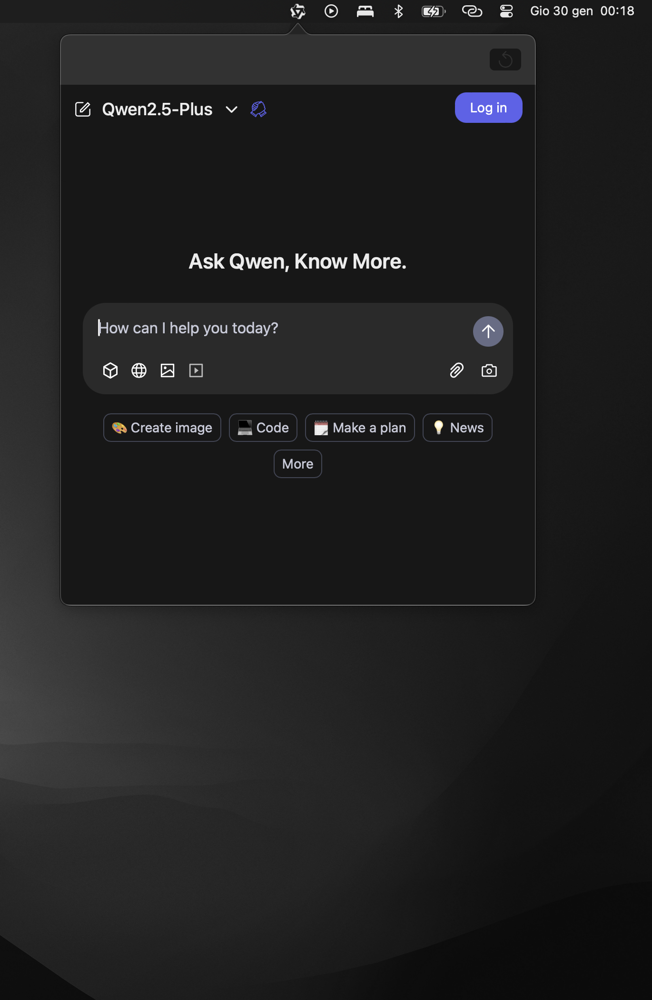

# Qwen Mac Menu Bar

**Bringing the power of Alibaba Cloud's Qwen LLM to your macOS menu bar!**

This lightweight macOS application provides quick and convenient access to Qwen, a powerful large language model, directly from your menu bar. Get instant answers, generate text, translate languages, and much more without interrupting your workflow.

## Features

*   **Instant Access:** Trigger the Qwen interface with a global keyboard shortcut (`Shift + Cmd + C`).
*   **Resizable Window:** Adjust the popover window size to your preference.
*   **Clean Cookies:** Easily clear cookies with a right-click on the menu bar icon to log in with a different account.
*   **Web Shortcuts:** Supports standard web browsing shortcuts like `Cmd + C/V/X/Z/A`.
*   **macOS Native:** Built using Swift and SwiftUI for a seamless macOS experience.

## Preview

## Requirements

*   macOS 12.5 or later

## Usage

1. **Activate:** Press `Shift + Cmd + C` to bring up the Qwen popover window.
2. **Interact:** Type your query or command into the Qwen interface.
3. **Customize:** Right-click the menu bar icon for options like clearing cookies.

## Why Qwen?

*   **Powerful AI:** Qwen is a state-of-the-art large language model developed by Alibaba Cloud.
*   **Multilingual:** Qwen excels in multiple languages, making it a versatile tool for a global audience.
*   **Open Source:** Qwen is an open source LLM.

## Contributing

We welcome contributions! If you have ideas for improvements, bug fixes, or new features, please:

1. **Fork** the repository.
2. Create a new **branch** for your feature.
3. **Commit** your changes with clear commit messages.
4. Open a **pull request**, and we'll be happy to review it.

## Credits

*   **Alibaba Cloud:** For developing the impressive Qwen large language model.
*   **[KittenYang](https://github.com/KittenYang):** The original app was inspired by KittenYang's ChatGPT-Mac-MenuBar.

## License

This project is licensed under the MIT License - see the [LICENSE](LICENSE) file for details.

## Disclaimer

This application is an independent project and is not officially affiliated with Alibaba Cloud.

---
